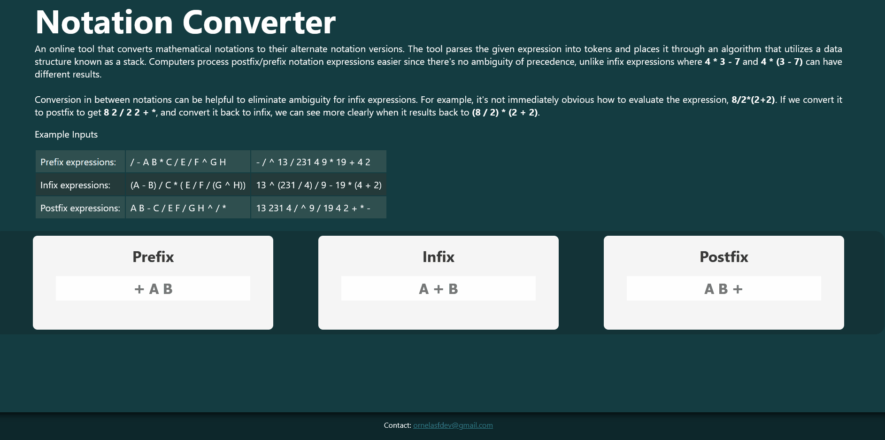

# Prefix - Infix - Postfix Converter
An educational web app that demonstrates how to convert between the different types of mathematical notations

### Dev
Developed using
- React
- Redux
- NodeJS
- CSS

`npm start`
Runs app in development mode

### Site
https://notationconverter.azurewebsites.net/
